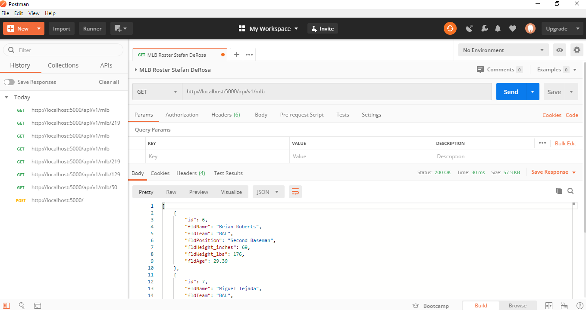
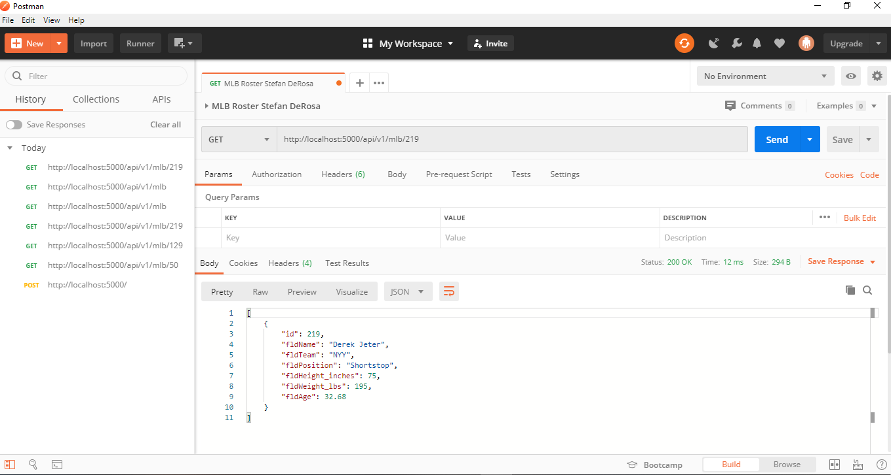
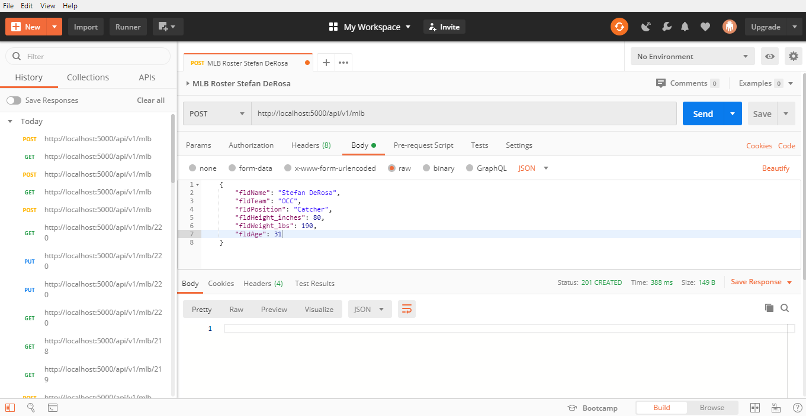
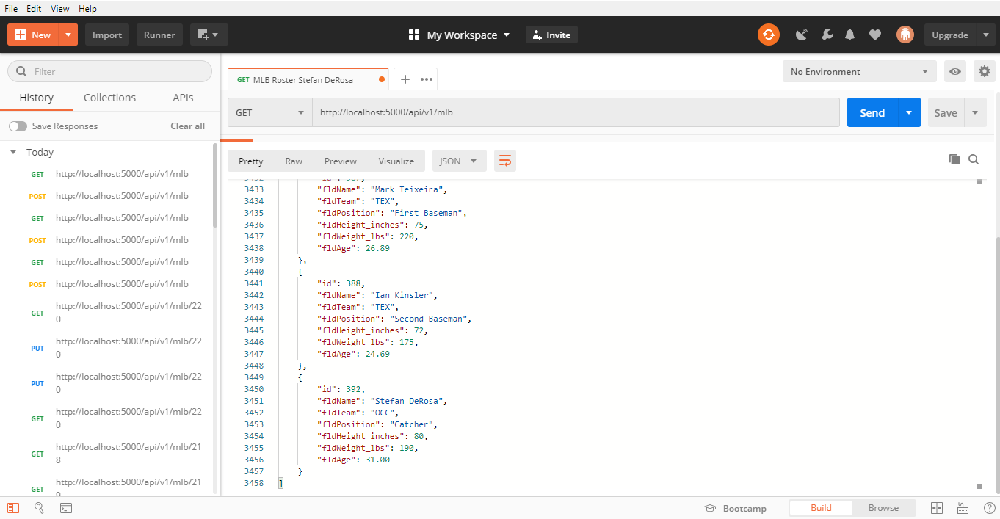
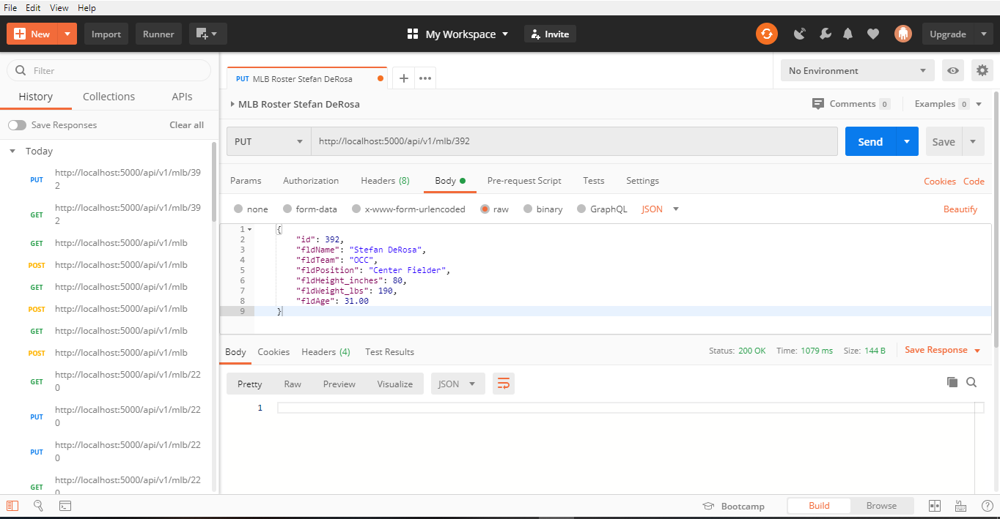
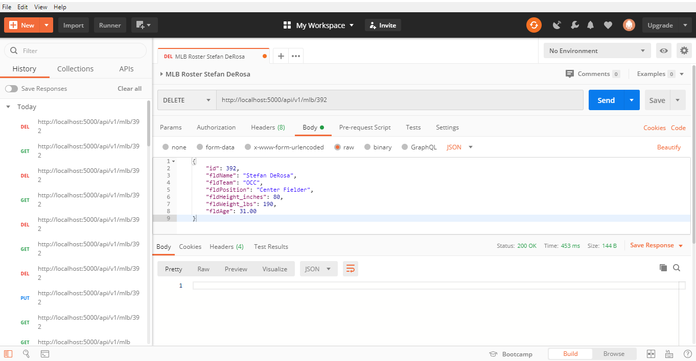

# Project Description
Assignment 4 - The goal of this assignment is to create a full website and utilize Postman and the following request:

1. Get - Read
2. Post - Insert
3. Push - Update
4. Delete

# Postman - Get All Records

# Get One Record

# Post Request 1

# Post Request 2

# Put Request

# Delete Request

