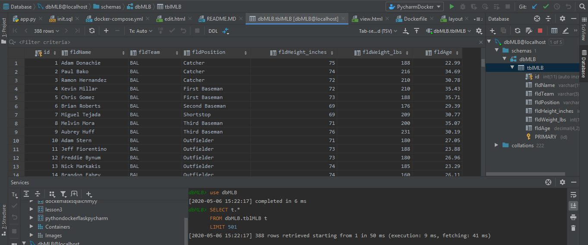
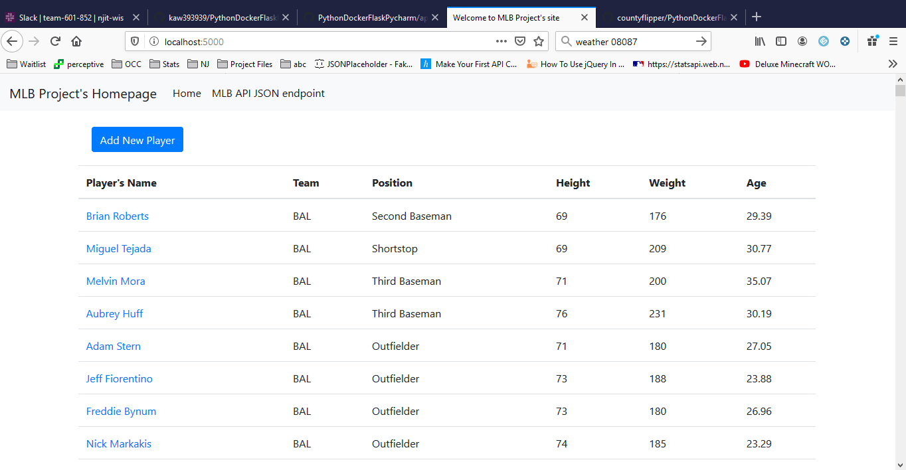
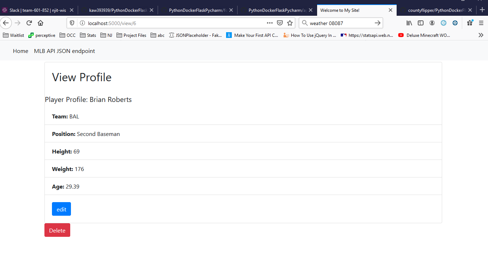
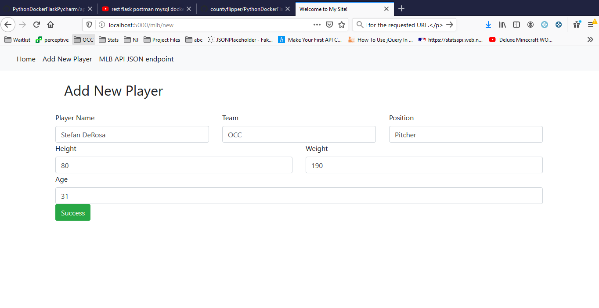
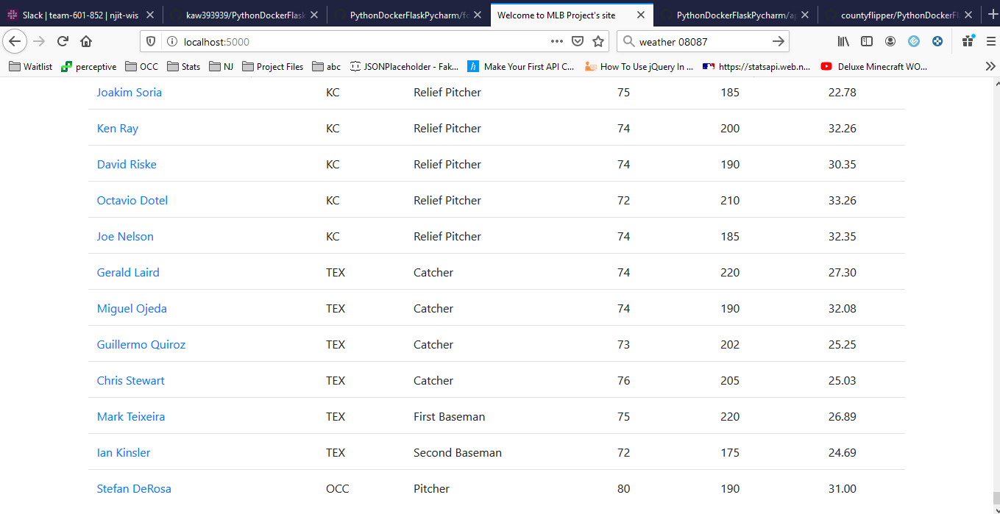
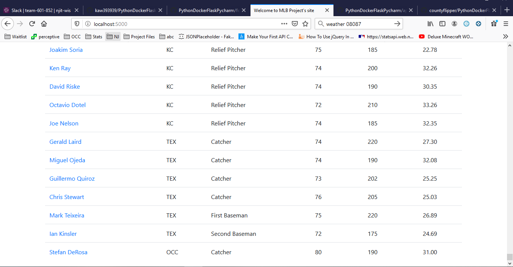
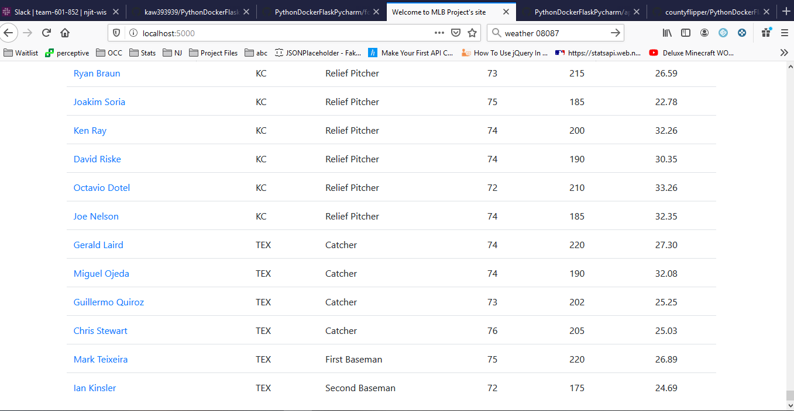

# Project Description
Assignment 3 - The goal of this assignment is to create a full website to import you own data, and add the following functionality: Create/Add, Edit/Update, Delete, and view.

# Pycharm Table Screenshot

# Homepage Screenshot

# View Record

# Add New Record Part 1

# Add New Record Part 2

# Update Record

# Delete Record

