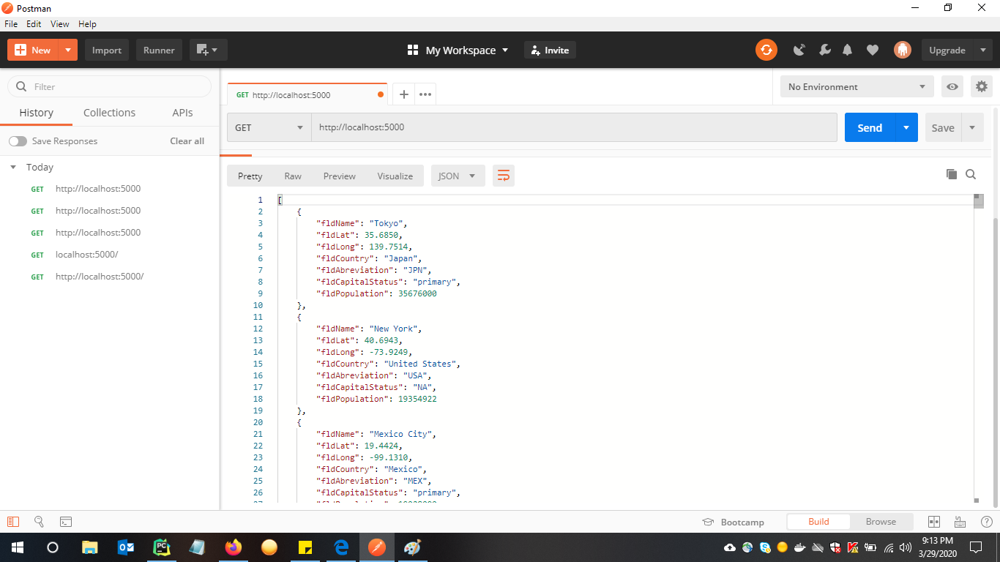
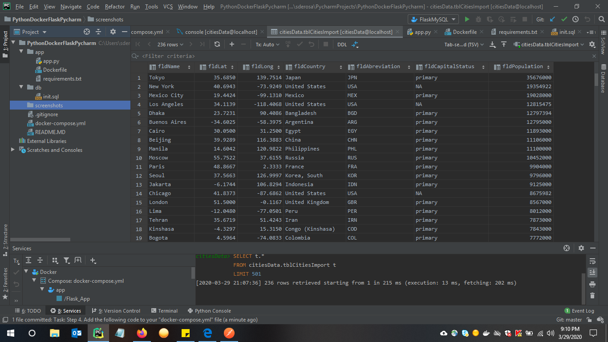
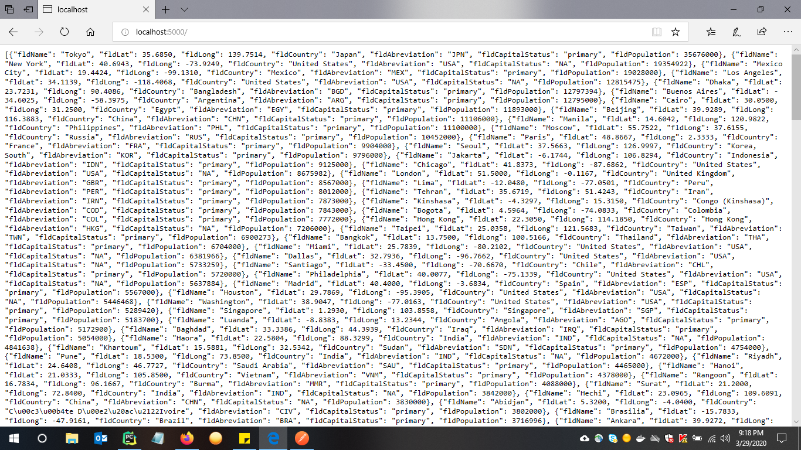
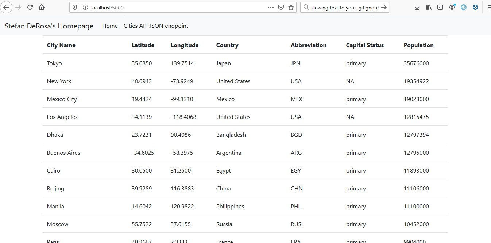

#Project Description
Assignment 1 - This project is a homework assignment to teach how to get Pycharm setup with Docker, Flask, MSQL/
Assignment 2 - Setup a BootStrpa HTML Template using Flask Templates and use it to display data retrieved from your database.

# Postman Screenshot

# Database Screenshot

# Localhost Screenshot

# Bootstrap Screenshot
